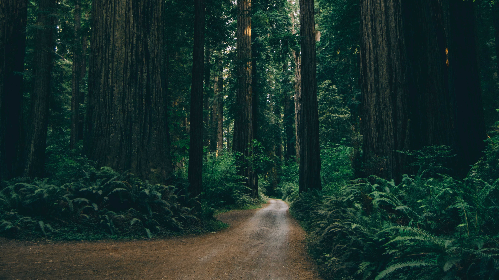

<h1 align="center"> Welcome to my GitHub Page </h2>

 
<h3 align="center"> About me </h3>

I am a student of computer science, at the faculty of Computer Science and Management 

<h3 align="center"> :gem: Software development interests </h3>

I focus on developing my programming skills. I'm also interested in software craftsmanship and try to consistently improve quality of my code.

<h3 align="center"> :bicyclist: Beside that </h3>

I am enthusiast of productivity and self-improvement. I passionately practice calishtenic/street workout and body building. My hobby is also cycling

 
<h3 align="center"> :mailbox: Contact </h3>

Feel free to contact with me in every case

gajerski.lukasz@gmail.com

